Team 2 - Data Analysis
================

# Initialize

``` r
library(ggplot2)
```

# Load Data

``` r
sales_cities <- read.csv("project.sales.cities.csv")
sales_counties <- read.csv("project.sales.counties.csv")
sales_zipcodes <- read.csv("project.sales.zipcodes.csv")
acs_cities <- read.csv("project.acs.cities.csv")
acs_counties <- read.csv("project.acs.counties.csv")
acs_zipcodes <- read.csv("project.acs.zipcodes.csv")
```

# Rename Columns

``` r
colnames(acs_cities) <- c("city", "High School", "Bachelor", "Unemployment", "Income", "Population", "White Population", "Black Population", "Indian Population", "Asain Population", "Hawaiian Population", "Other Population", "Multi Population")
colnames(acs_counties) <- c("county", "High School", "Bachelor", "Unemployment", "Income", "Population", "White Population", "Black Population", "Indian Population", "Asain Population", "Hawaiian Population", "Other Population", "Multi Population")
colnames(acs_zipcodes) <- c("zipcode", "High School", "Bachelor", "Unemployment", "Income", "Population", "White Population", "Black Population", "Indian Population", "Asain Population", "Hawaiian Population", "Other Population", "Multi Population")
colnames(sales_cities) <- c("city", "Category", "Sales_Dollars", "Sales Volume")
colnames(sales_counties) <- c("county", "Category", "Sales_Dollars", "Sales_Volume")
colnames(sales_zipcodes) <- c("zipcode", "Category", "Sales_Dollars", "Sales_Volume")
```

# Merge Data sets by Geography

``` r
city_data <- merge(sales_cities, acs_cities, by = "city")
county_data <- merge(sales_counties, acs_counties, by = "county")
zipcode_data <- merge(sales_zipcodes,acs_zipcodes, by= "zipcode")
```

# Convert to Numeric as Needed

``` r
city_data$Sales_Dollars <- as.numeric(city_data$Sales_Dollars)
city_data$Population <- as.numeric(city_data$Population)
county_data$Sales_Dollars <- as.numeric(county_data$Sales_Dollars)
county_data$Population <- as.numeric(county_data$Population)
zipcode_data$Sales_Dollars <- as.numeric(zipcode_data$Sales_Dollars)
zipcode_data$Population <- as.numeric(zipcode_data$Population)
```

# Calculate Total Sales and Per Capita Sales for City/Zip/County

``` r
total_city <- aggregate(Sales_Dollars ~ city, city_data, sum)
pop_city <- aggregate(Population ~ city, city_data, sum)
sale_info_city <- merge(total_city, pop_city, by = "city", all = TRUE)
sale_info_city$per_capita_sales <- with(sale_info_city, Sales_Dollars/Population)

total_zip <- aggregate(Sales_Dollars ~ zipcode, zipcode_data, sum)
pop_zip <- aggregate(Population ~ zipcode, zipcode_data, sum)
sale_info_zip <- merge(total_zip, pop_zip, by = "zipcode", all = TRUE)
sale_info_zip$per_capita_sales <- with(sale_info_zip, Sales_Dollars/Population)

total_county <- aggregate(Sales_Dollars ~ county, county_data, sum)
pop_county <- aggregate(Population ~ county, county_data, sum)
sale_info_county <- merge(total_county, pop_county, by = "county", all = TRUE)
sale_info_county$per_capita_sales <- with(sale_info_county, Sales_Dollars/Population)
```

# Calculate R between Pop Sales and Per Capita Sales

``` r
r_sales_city <- cor(sale_info_city$Sales_Dollars, sale_info_city$per_capita_sales)
cat("Total Sales vs Per Capita Sales by CITY, R:", r_sales_city)
```

    ## Total Sales vs Per Capita Sales by CITY, R: 0.1840089

``` r
r_sales_zip <- cor(sale_info_zip$Sales_Dollars, sale_info_zip$per_capita_sales)
cat("Total Sales vs Per Capita Sales by ZIPCODE, R:", r_sales_zip)
```

    ## Total Sales vs Per Capita Sales by ZIPCODE, R: 0.4954541

``` r
r_sales_county <- cor(sale_info_county$Sales_Dollars, sale_info_county$per_capita_sales)
cat("Total Sales vs Per Capita Sales by COUNTY, R:", r_sales_county)
```

    ## Total Sales vs Per Capita Sales by COUNTY, R: 0.4988217

NOTE: Weak correlation btwn Total Sales and Per Capita Sales on City
Moderate correlation btwn Total Sales and Per Capita Sales on Zipcode
and County. What this means. Although there are a lot of people in
cities it doesn’t look like many are buying. Better to target via
Zipcode and County.

# Plot Data to Visualize Correlation

``` r
plot_citySales <- ggplot(sale_info_city, aes(x=Sales_Dollars, y=per_capita_sales)) +
  geom_point() +
  labs(title="City Total Sales vs Per Capita Sales [R = 0.184]",
       x="Total Sales",
       y="Per Capita Sales") +
  theme(legend.position="none") + 
  geom_smooth(method = lm, se=FALSE)
plot_citySales + scale_x_log10()
```

    ## `geom_smooth()` using formula = 'y ~ x'

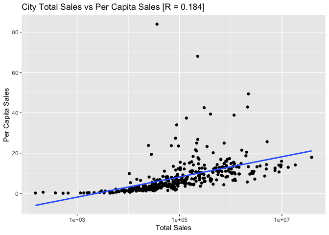<!-- -->

``` r
plot_zipSales <- ggplot(sale_info_zip, aes(x=Sales_Dollars, y=per_capita_sales)) +
  geom_point() +
  labs(title="Zipcode Total Sales vs Per Capita Sales [R = 0.495]",
       x="Total Sales",
       y="Per Capita Sales") +
  theme(legend.position="none") + 
  geom_smooth(method = lm, se=FALSE)
plot_zipSales + scale_x_log10()
```

    ## `geom_smooth()` using formula = 'y ~ x'

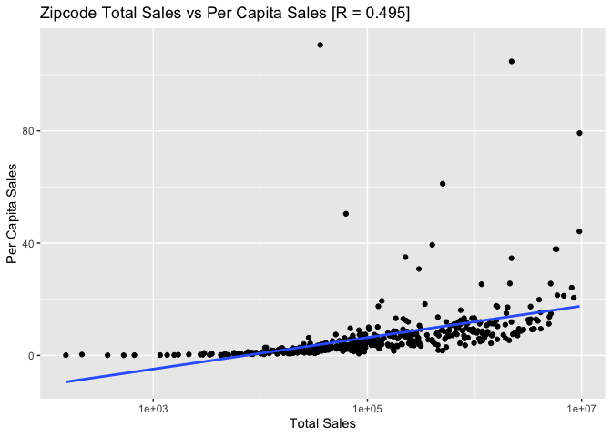<!-- -->

``` r
plot_countySales <- ggplot(sale_info_county, aes(x=Sales_Dollars, y=per_capita_sales)) +
  geom_point() +
  labs(title="County Total Sales vs Per Capita Sales [R = 0.499]",
       x="Total Sales",
       y="Per Capita Sales") +
  theme(legend.position="none") + 
  geom_smooth(method = lm, se=FALSE)
plot_countySales + scale_x_log10()
```

    ## `geom_smooth()` using formula = 'y ~ x'

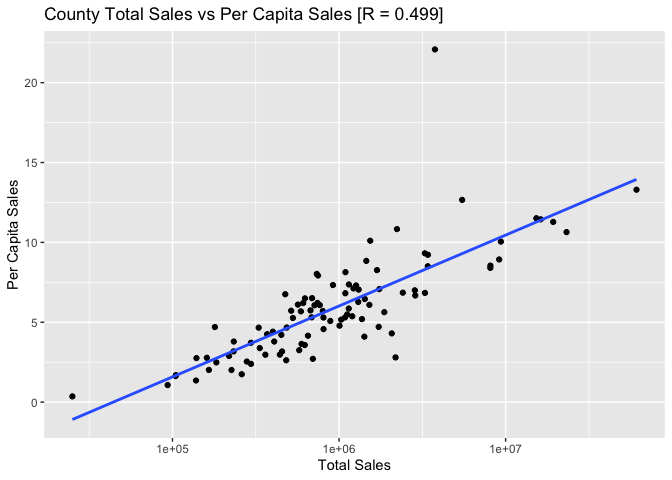<!-- --> NOTE: These
plots all have a logorithmic x-axis. Although they may appear somewhat
linear with a high correlation coefficient, I can assure you that is not
the case. The logorithmic transformation is just so the data is easily
digestible to the eye.

# Calculate R between Sales and Population

``` r
r_city_SalesVsPop <- cor(city_data$Sales_Dollars, city_data$Population)
r_county_SalesVsPop <-cor(county_data$Sales_Dollars, county_data$Population)
r_zipcode_SalesVsPop <-cor(zipcode_data$Sales_Dollars, zipcode_data$Population)
```

The correlation coefficients between Sales and Population at the city
level and county level are the highest at 0.6674 and 0.6533
respectively. Zipcodes still shows a correlation, but it is a weak one
at 0.5013

# Calculate avg. Sales by Zipcode

``` r
zipcode_avg_sales <- aggregate(Sales_Dollars ~ zipcode, data = zipcode_data, mean)
colnames(zipcode_avg_sales)[2] <- "Sales_Dollars"
```

# Calculate avg. Sales by City

``` r
city_avg_sales <- aggregate(Sales_Dollars ~ city, data = city_data, mean)
```

# Merge Zip and City by avg. Sales

``` r
# Like a good data scientist... we go find more data :)
# found this open source on GitHub vvvv
zip_to_city <- read.csv('iowa_zip_lookup.csv')
colnames(zip_to_city) <- c("zipcode", "city", "county")
# Merge zip & city info to avg sales in cities by city column
init_merge <- merge(zip_to_city, city_avg_sales, by="city", all=TRUE)
colnames(init_merge)[4] <- "city_avg_sales"
# Now merge with zipcode avg sales on the zipcode column
merged_data <- merge(init_merge, zipcode_avg_sales, by = "zipcode", all = TRUE)
colnames(merged_data)[5] <- "zipcode_avg_sales"
# remove all NA rows, bc project data doesn't account for all zipcodes where the
# zipcode-city-county data I imported does.
merged_data <- na.omit(merged_data)
```

# Calculate R btwn avg. Sales per Zipcode and avg. Sales per City

``` r
r <- cor(merged_data$zipcode_avg_sales, merged_data$city_avg_sales)
cat("The correlation coefficient between avg sales in cities and zipcodes is:",
    r)
```

    ## The correlation coefficient between avg sales in cities and zipcodes is: 0.574346

``` r
plot(merged_data$city_avg_sales, merged_data$zipcode_avg_sales,
     xlab = "Average Sales by City",
     ylab = "Average Sales by Zipcode",
     main = "Avg Sales by City vs Avg Sales by Zipcode")
model <- lm(zipcode_avg_sales~city_avg_sales, data=merged_data)
abline(model, col = "red") 
```

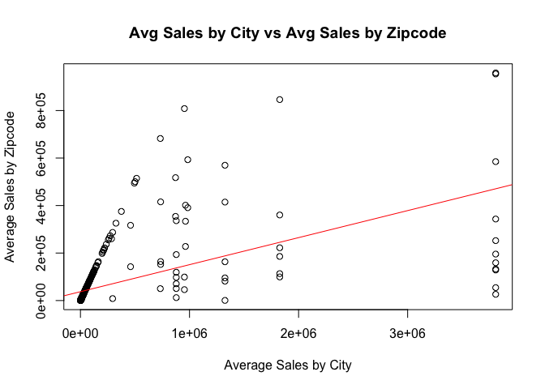<!-- -->

``` r
summary(model)
```

    ## 
    ## Call:
    ## lm(formula = zipcode_avg_sales ~ city_avg_sales, data = merged_data)
    ## 
    ## Residuals:
    ##     Min      1Q  Median      3Q     Max 
    ## -444434  -35012  -29811   -4964  662449 
    ## 
    ## Coefficients:
    ##                 Estimate Std. Error t value Pr(>|t|)    
    ## (Intercept)    3.728e+04  5.624e+03   6.629 1.05e-10 ***
    ## city_avg_sales 1.139e-01  7.947e-03  14.327  < 2e-16 ***
    ## ---
    ## Signif. codes:  0 '***' 0.001 '**' 0.01 '*' 0.05 '.' 0.1 ' ' 1
    ## 
    ## Residual standard error: 109200 on 417 degrees of freedom
    ## Multiple R-squared:  0.3299, Adjusted R-squared:  0.3283 
    ## F-statistic: 205.3 on 1 and 417 DF,  p-value: < 2.2e-16

``` r
plot(model$residuals,
     xlab = "Model Index",
     ylab = "Residuals",
     main = "Linear Regression Model Residuals")
abline(h=0, col='red')
```

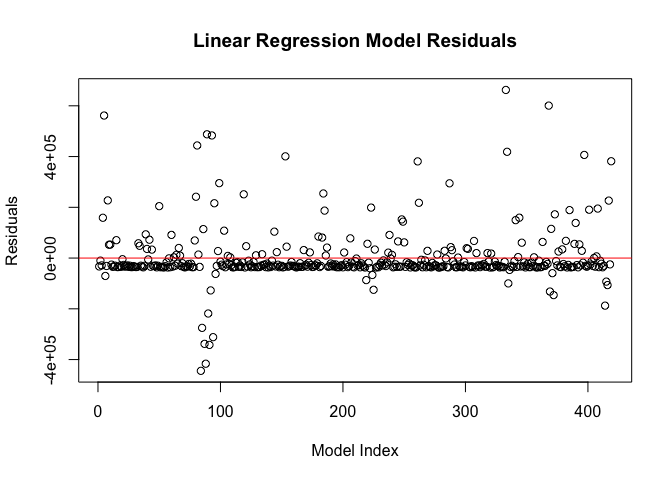<!-- --> NOTE: Our
residuals may look nice at first glance but we can see we are actually
predicting higher values than actual and the y axis is on a scale
hundreds of thousands. This is likely because all cities that have a
singular zipcode within our data set will show up as having equal avg
sales. This would then also heavily bias our correlation coefficient if
there were many instances of this which it appears is the case.

``` r
### Here's alternate approach, though maybe pointless
### Plot all points where avg sales are not equal
filtered_data <- subset(merged_data, merged_data$city_avg_sales!=merged_data$zipcode_avg_sales)
plot(filtered_data$city_avg_sales, 
     filtered_data$zipcode_avg_sales,
     xlab = "Average Sales by City",
     ylab = "Average Sales by Zipcode",
     main = "Alternate: Avg Sales by City vs Avg Sales by Zipcode")
model <- lm(zipcode_avg_sales~city_avg_sales, data=filtered_data)
abline(model, col = "green") 
```

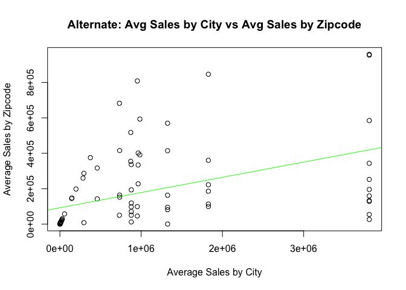<!-- -->

``` r
summary(model)
```

    ## 
    ## Call:
    ## lm(formula = zipcode_avg_sales ~ city_avg_sales, data = filtered_data)
    ## 
    ## Residuals:
    ##     Min      1Q  Median      3Q     Max 
    ## -393038  -90786  -80843   61631  633971 
    ## 
    ## Coefficients:
    ##                 Estimate Std. Error t value Pr(>|t|)    
    ## (Intercept)    9.244e+04  2.764e+04   3.344  0.00122 ** 
    ## city_avg_sales 8.587e-02  1.798e-02   4.776 7.29e-06 ***
    ## ---
    ## Signif. codes:  0 '***' 0.001 '**' 0.01 '*' 0.05 '.' 0.1 ' ' 1
    ## 
    ## Residual standard error: 204700 on 86 degrees of freedom
    ## Multiple R-squared:  0.2096, Adjusted R-squared:  0.2004 
    ## F-statistic: 22.81 on 1 and 86 DF,  p-value: 7.286e-06

``` r
plot(model$residuals,
     xlab = "Model Index",
     ylab = "Residuals",
     main = "Alternate: Linear Regression Model Residuals")
abline(h=0, col='green')
```

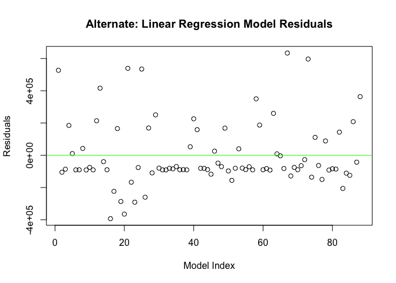<!-- -->

``` r
# NOTE: with our p-value increasing I am starting to believe we are getting a 
# more "legitimate" fit, but with R only equaling 0.2096 and our residuals 
# still appearing on a scale of hundreds of thousands, I conclude that we need
# a more comprehensive data set to see if there is a relation between avg sales
# per zip code and avg sales per corresponding city. 
```

# General Visualization

``` r
# Histogram of total sales by category
ggplot(sales_cities, aes(x=Category, y=Sales_Dollars)) + 
  geom_bar(stat="identity") +
  labs(title="Total Sales in Citites by Liquor Category ",
       x="Category",
       y="Total Sales")
```

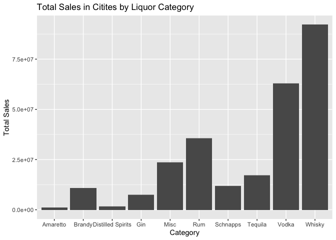<!-- -->

``` r
# Scatter plot of sales volume versus population
ggplot(city_data, aes(x = Population, y = Sales_Dollars)) +
  geom_point() +
  labs(title="Sales Volume vs Population",
       x = "Population",
       y = "Sales Volume")
```

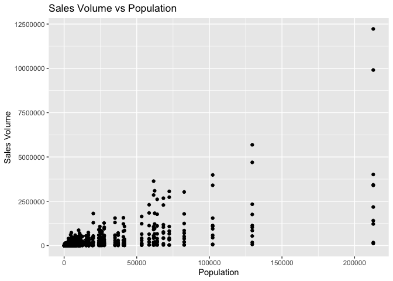<!-- -->

# Correlation: Total Sales vs Population per Category

``` r
# Calculate correlation coefficient between sales and population for each category
whisky_r <- cor(city_data$Sales_Dollars[city_data$Category == "Whisky"], city_data$Population[city_data$Category == "Whisky"])
cat("Population Size vs Total Sales, WHISKY, R:", whisky_r)
```

    ## Population Size vs Total Sales, WHISKY, R: 0.9729456

``` r
vodka_r <- cor(city_data$Sales_Dollars[city_data$Category == "Vodka"], city_data$Population[city_data$Category == "Vodka"])
cat("Population Size vs Total Sales, VODKA, R:", vodka_r)
```

    ## Population Size vs Total Sales, VODKA, R: 0.9686541

``` r
rum_r <- cor(city_data$Sales_Dollars[city_data$Category == "Rum"], city_data$Population[city_data$Category == "Rum"])
cat("Population Size vs Total Sales, RUM, R:", rum_r)
```

    ## Population Size vs Total Sales, RUM, R: 0.9821624

``` r
gin_r <- cor(city_data$Sales_Dollars[city_data$Category == "Gin"], city_data$Population[city_data$Category == "Gin"])
cat("Population Size vs Total Sales, GIN, R:", gin_r)
```

    ## Population Size vs Total Sales, GIN, R: 0.9561714

``` r
tequila_r <- cor(city_data$Sales_Dollars[city_data$Category == "Tequila"], city_data$Population[city_data$Category == "Tequila"])
cat("Population Size vs Total Sales, TEQUILA, R:", tequila_r)
```

    ## Population Size vs Total Sales, TEQUILA, R: 0.9392216

``` r
brandy_r <- cor(city_data$Sales_Dollars[city_data$Category == "Brandy"], city_data$Population[city_data$Category == "Brandy"])
cat("Population Size vs Total Sales, BRANDY, R:", brandy_r)
```

    ## Population Size vs Total Sales, BRANDY, R: 0.9077972

NOTE: Whiskey returns NA, likely because there was a city that did not
have data for whiskey. We could go looking for it and/or create a loop
to exclude that city, BUT by the correlation coefficients for the rest
of the categories we can assume that whiskey follows in suit.

We can see as population increases so does your total number of sales
which makes sense.

# PART 2 of the Research Question

## Does the avg sales per zipcode and per corresponding pattern differ across liquor categories

############################################################################## 

# NOTE: Avg sales per Category per Zip is just the amount of sales.

# Cities however we will have to calculate, BUT I can already see it

# happening again… we will have cities with one zip code creating

# a one to one ratio between the two values and then the rest will

# appear as outliers.

# Basic way is subset for category and try and draw correlations from each

######## This below section is repeated for each category

``` r
dat_wh <- subset(city_data, city_data$Category == "Whisky", select=c(city, Category, Sales_Dollars))
dat_wh <- merge(dat_wh, zip_to_city, by="city", all = T)
colnames(dat_wh) <- c("city", "category", "city_sales", "zipcode", "county")
dat_wh <- merge(zipcode_data, dat_wh, by="zipcode", all = T)
dat_wh <- subset(dat_wh, dat_wh$Category == "Whisky", select=c(zipcode, Category, Sales_Dollars, city, category, city_sales))
dat_wh <- na.omit(dat_wh)

# I could go in and rename these again but just know...
# Sales_dollars is the avg zip sales and city_sales is avg city sales
dat_wh_r <- cor(dat_wh$Sales_Dollars, dat_wh$city_sales)
cat("Correlation of avg Whisky sales between cities and zipcodes is:", dat_wh_r)
```

    ## Correlation of avg Whisky sales between cities and zipcodes is: 0.562654

``` r
######## Amaretto ############################################################
dat_am <- subset(city_data, city_data$Category == "Amaretto", select=c(city, Category, Sales_Dollars))
dat_am <- merge(dat_am, zip_to_city, by="city", all = T)
colnames(dat_am) <- c("city", "category", "city_sales", "zipcode", "county")
dat_am <- merge(zipcode_data, dat_am, by="zipcode", all = T)
dat_am <- subset(dat_am, dat_am$Category == "Amaretto", select=c(zipcode, Category, Sales_Dollars, city, category, city_sales))
dat_am <- na.omit(dat_am)

dat_am_r <- cor(dat_am$Sales_Dollars, dat_am$city_sales)
cat("Correlation of avg Amaretto sales between cities and zipcodes is:", dat_am_r)
```

    ## Correlation of avg Amaretto sales between cities and zipcodes is: 0.5275947

``` r
######## Brandy ###############################################################
dat_br <- subset(city_data, city_data$Category == "Brandy", select=c(city, Category, Sales_Dollars))
dat_br <- merge(dat_br, zip_to_city, by="city", all = T)
colnames(dat_br) <- c("city", "category", "city_sales", "zipcode", "county")
dat_br <- merge(zipcode_data, dat_br, by="zipcode", all = T)
dat_br <- subset(dat_br, dat_br$Category == "Brandy", select=c(zipcode, Category, Sales_Dollars, city, category, city_sales))
dat_br <- na.omit(dat_br)

dat_br_r <- cor(dat_br$Sales_Dollars, dat_br$city_sales)
cat("Correlation of avg Brandy sales between cities and zipcodes is:", dat_br_r)
```

    ## Correlation of avg Brandy sales between cities and zipcodes is: 0.6409222

``` r
######## Distilled Spirits ####################################################
dat_ds <- subset(city_data, city_data$Category == "Distilled Spirits", select=c(city, Category, Sales_Dollars))
dat_ds <- merge(dat_ds, zip_to_city, by="city", all = T)
colnames(dat_ds) <- c("city", "category", "city_sales", "zipcode", "county")
dat_ds <- merge(zipcode_data, dat_ds, by="zipcode", all = T)
dat_ds <- subset(dat_ds, dat_ds$Category == "Distilled Spirits", select=c(zipcode, Category, Sales_Dollars, city, category, city_sales))
dat_ds <- na.omit(dat_ds)

dat_ds_r <- cor(dat_ds$Sales_Dollars, dat_ds$city_sales)
cat("Correlation of avg Distilled Spirits sales between cities and zipcodes is:", dat_ds_r)
```

    ## Correlation of avg Distilled Spirits sales between cities and zipcodes is: 0.5218948

``` r
######## Gin ##################################################################
dat_g <- subset(city_data, city_data$Category == "Gin", select=c(city, Category, Sales_Dollars))
dat_g <- merge(dat_g, zip_to_city, by="city", all = T)
colnames(dat_g) <- c("city", "category", "city_sales", "zipcode", "county")
dat_g <- merge(zipcode_data, dat_g, by="zipcode", all = T)
dat_g <- subset(dat_g, dat_g$Category == "Gin", select=c(zipcode, Category, Sales_Dollars, city, category, city_sales))
dat_g <- na.omit(dat_g)

dat_g_r <- cor(dat_g$Sales_Dollars, dat_g$city_sales)
cat("Correlation of avg Gin sales between cities and zipcodes is:", dat_g_r)
```

    ## Correlation of avg Gin sales between cities and zipcodes is: 0.5789945

``` r
######## Misc #################################################################
dat_mc <- subset(city_data, city_data$Category == "Misc", select=c(city, Category, Sales_Dollars))
dat_mc <- merge(dat_mc, zip_to_city, by="city", all = T)
colnames(dat_mc) <- c("city", "category", "city_sales", "zipcode", "county")
dat_mc <- merge(zipcode_data, dat_mc, by="zipcode", all = T)
dat_mc <- subset(dat_mc, dat_mc$Category == "Misc", select=c(zipcode, Category, Sales_Dollars, city, category, city_sales))
dat_mc <- na.omit(dat_mc)

dat_mc_r <- cor(dat_mc$Sales_Dollars, dat_mc$city_sales)
cat("Correlation of avg Misc sales between cities and zipcodes is:", dat_mc_r)
```

    ## Correlation of avg Misc sales between cities and zipcodes is: 0.550791

``` r
######## Rum ##################################################################
dat_ru <- subset(city_data, city_data$Category == "Rum", select=c(city, Category, Sales_Dollars))
dat_ru <- merge(dat_ru, zip_to_city, by="city", all = T)
colnames(dat_ru) <- c("city", "category", "city_sales", "zipcode", "county")
dat_ru <- merge(zipcode_data, dat_ru, by="zipcode", all = T)
dat_ru <- subset(dat_ru, dat_ru$Category == "Rum", select=c(zipcode, Category, Sales_Dollars, city, category, city_sales))
dat_ru <- na.omit(dat_ru)

dat_ru_r <- cor(dat_ru$Sales_Dollars, dat_ru$city_sales)
cat("Correlation of avg Rum sales between cities and zipcodes is:", dat_ru_r)
```

    ## Correlation of avg Rum sales between cities and zipcodes is: 0.5525119

``` r
######## Schnapps #############################################################
dat_sc <- subset(city_data, city_data$Category == "Schnapps", select=c(city, Category, Sales_Dollars))
dat_sc <- merge(dat_sc, zip_to_city, by="city", all = T)
colnames(dat_sc) <- c("city", "category", "city_sales", "zipcode", "county")
dat_sc <- merge(zipcode_data, dat_sc, by="zipcode", all = T)
dat_sc <- subset(dat_sc, dat_sc$Category == "Schnapps", select=c(zipcode, Category, Sales_Dollars, city, category, city_sales))
dat_sc <- na.omit(dat_sc)

dat_sc_r <- cor(dat_sc$Sales_Dollars, dat_sc$city_sales)
cat("Correlation of avg Schnapps sales between cities and zipcodes is:", dat_sc_r)
```

    ## Correlation of avg Schnapps sales between cities and zipcodes is: 0.5201962

``` r
######## Tequila #############################################################
dat_tq <- subset(city_data, city_data$Category == "Tequila", select=c(city, Category, Sales_Dollars))
dat_tq <- merge(dat_tq, zip_to_city, by="city", all = T)
colnames(dat_tq) <- c("city", "category", "city_sales", "zipcode", "county")
dat_tq <- merge(zipcode_data, dat_tq, by="zipcode", all = T)
dat_tq <- subset(dat_tq, dat_tq$Category == "Tequila", select=c(zipcode, Category, Sales_Dollars, city, category, city_sales))
dat_tq <- na.omit(dat_tq)

dat_tq_r <- cor(dat_tq$Sales_Dollars, dat_tq$city_sales)
cat("Correlation of avg Tequila sales between cities and zipcodes is:", dat_tq_r)
```

    ## Correlation of avg Tequila sales between cities and zipcodes is: 0.5592652

``` r
######## Vodka ############################################################
dat_vk <- subset(city_data, city_data$Category == "Vodka", select=c(city, Category, Sales_Dollars))
dat_vk <- merge(dat_vk, zip_to_city, by="city", all = T)
colnames(dat_vk) <- c("city", "category", "city_sales", "zipcode", "county")
dat_vk <- merge(zipcode_data, dat_vk, by="zipcode", all = T)
dat_vk <- subset(dat_vk, dat_vk$Category == "Vodka", select=c(zipcode, Category, Sales_Dollars, city, category, city_sales))
dat_vk <- na.omit(dat_vk)

dat_vk_r <- cor(dat_vk$Sales_Dollars, dat_vk$city_sales)
cat("Correlation of avg Vodka sales between cities and zipcodes is:", dat_vk_r)
```

    ## Correlation of avg Vodka sales between cities and zipcodes is: 0.5898696

``` r
#####
```

``` r
# Plot a couple to see what they look like

# Vodka
ggplot(dat_vk, aes(x=Sales_Dollars, y=city_sales)) +
  geom_point() +
  labs(title="Vodka avg City Sales vs avg Zipcode Sales",
       x="avg Zipcode Sales",
       y="avg City Sales") +
  geom_smooth(method = lm, se=FALSE)
```

    ## `geom_smooth()` using formula = 'y ~ x'

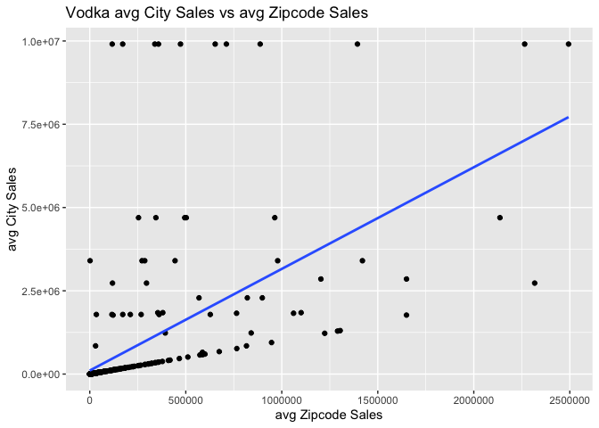<!-- -->

``` r
# Whiskey
ggplot(dat_wh, aes(x=Sales_Dollars, y=city_sales)) +
  geom_point() +
  labs(title="Whisky avg City Sales vs avg Zipcode Sales",
       x="avg Zipcode Sales",
       y="avg City Sales") +
  geom_smooth(method = lm, se=FALSE)
```

    ## `geom_smooth()` using formula = 'y ~ x'

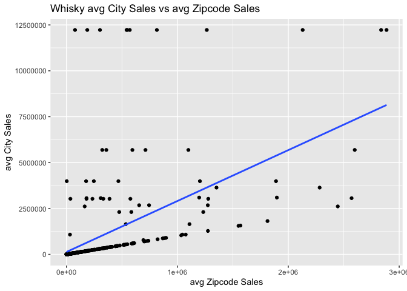<!-- -->

``` r
# Brandy
ggplot(dat_br, aes(x=Sales_Dollars, y=city_sales)) +
  geom_point() +
  labs(title="Brandy avg City Sales vs avg Zipcode Sales",
       x="avg Zipcode Sales",
       y="avg City Sales") +
  geom_smooth(method = lm, se=FALSE)
```

    ## `geom_smooth()` using formula = 'y ~ x'

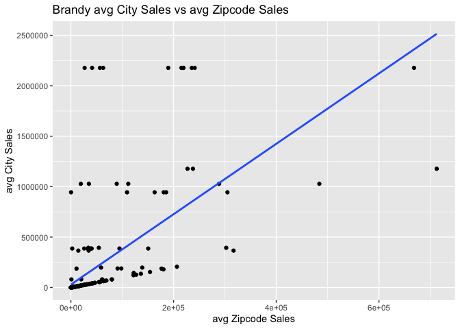<!-- -->

``` r
# Gin
ggplot(dat_g, aes(x=Sales_Dollars, y=city_sales)) +
  geom_point() +
  labs(title="Gin avg City Sales vs avg Zipcode Sales",
       x="avg Zipcode Sales",
       y="avg City Sales") +
  geom_smooth(method = lm, se=FALSE)
```

    ## `geom_smooth()` using formula = 'y ~ x'

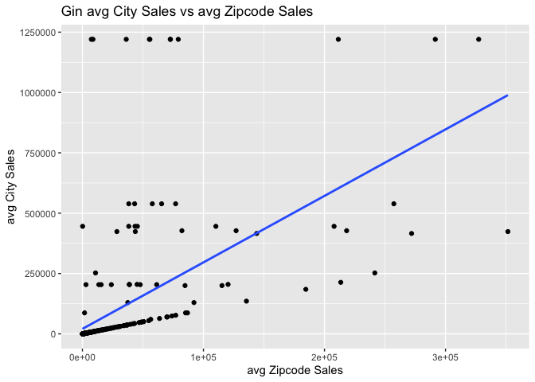<!-- -->

We can see from the plots they are all very similar and don’t show a
very strong correlation. There is a correlation, but it is not very
high.
